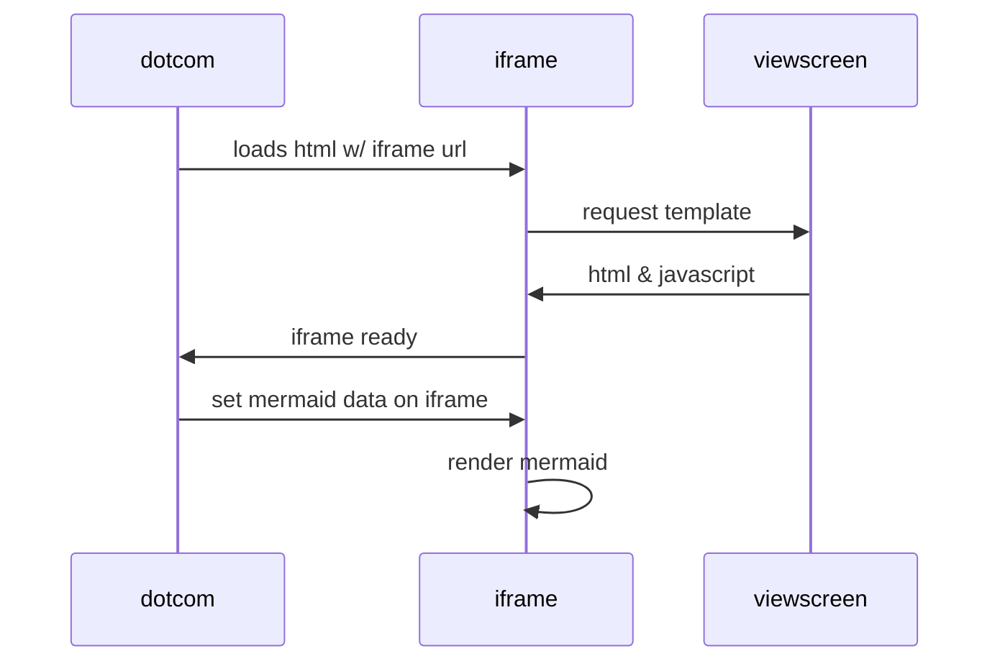

# Main App module to run all of the modules.

## Example Mermaid output
This will be updated later, included for snag.

```mermaid
sequenceDiagram
    participant dotcom
    participant iframe
    participant viewscreen
    dotcom->>iframe: loads html w/ iframe url
    iframe->>viewscreen: request template
    viewscreen->>iframe: html & javascript
    iframe->>dotcom: iframe ready
    dotcom->>iframe: set mermaid data on iframe
    iframe->>iframe: render mermaid
```